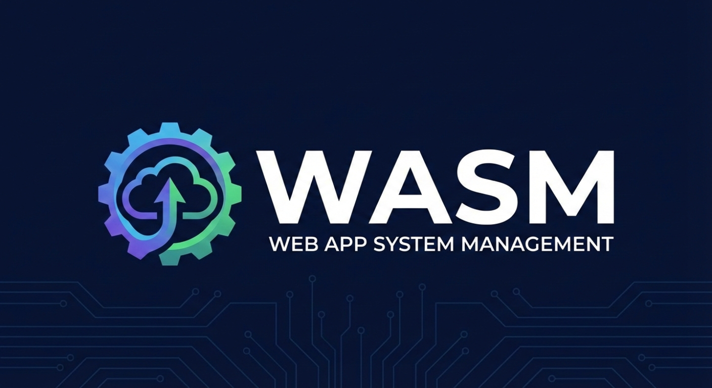
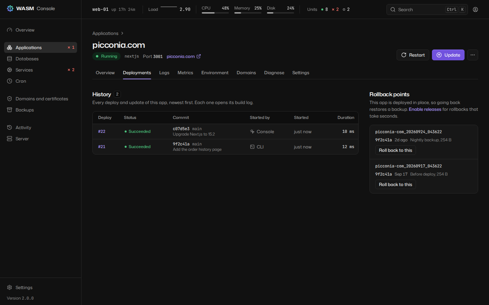

# WASM - Web App System Management

<p align="center">
  
</p>

<p align="center">
  <a href="https://build.opensuse.org/package/show/home:Perkybeet/wasm">
    
  </a>
  <a href="https://pypi.org/project/wasm-cli/">
    
  </a>
  <a href="https://pypi.org/project/wasm-cli/">
    
  </a>
  <a href="https://github.com/Perkybeet/wasm/blob/main/LICENSE">
    
  </a>
  <a href="https://github.com/Perkybeet/wasm/stargazers">
    
  </a>
  <a href="https://pypi.org/project/wasm-cli/">
    
  </a>
</p>

**Your server, Vercel-grade. No Docker required.**

WASM deploys web applications onto a Linux server you own and keeps them running. Point it
at a repository and a domain: it builds the application, runs it as a systemd unit behind
nginx or Apache, obtains its certificate, and from then on every deploy is a new release
that only goes live if it answers, and can be undone in seconds. The same engine is driven
from the CLI, a browser console and a JSON API.


> Upgrading from 1.x? Read [docs/UPGRADING-2.0.md](docs/UPGRADING-2.0.md) first. Existing
> applications keep running exactly as they are until you migrate them, one at a time.

---

## What WASM is, and is not

**It is**

- **One server.** A VPS or a bare-metal machine running Ubuntu, Debian, Fedora or openSUSE.
- **systemd-native.** Every application is a unit you can inspect with `systemctl` and
  `journalctl`; every site is a file in `/etc/nginx` or `/etc/apache2`. Nothing sits between
  you and your processes, and there is no daemon with a privileged socket.
- **A distribution package.** Installed with `apt`, `dnf` or `zypper`, or from PyPI.
- **Atomic deploys with instant rollback.** Each deploy builds in its own directory, is
  activated behind a health check, rolls back by itself when it does not answer, and any
  release still on disk can be reactivated in seconds. (Monorepo and Docker Compose projects
  still deploy in place.)
- **Per-application resource limits** with cgroups: memory, CPU and tasks.
- **A console and an API** over exactly what the CLI does, with scoped tokens, two-factor
  authentication, sudo mode and an audit log.

**It is not**

- **A cluster or an orchestrator.** One machine, managed from itself.
- **A container platform.** Applications run as ordinary processes. Docker is only needed if
  you deploy a Docker Compose project, which WASM then runs as a unit.
- **An isolation boundary between applications.** They run as the same service account by
  default. Deploy only code you trust, as you would on any server you administer.
- **Zero-downtime.** Activating a release restarts the unit. Per-branch preview deployments,
  one-click templates, a web terminal and blue/green activation are not in 2.0.

---

## Install

WASM needs root: it writes to `/etc`, `/var` and systemd. Run the commands below as root, or
prefix them with `sudo`.

### Ubuntu and Debian (recommended)

```bash
# Add GPG key
curl -fsSL https://download.opensuse.org/repositories/home:/Perkybeet/xUbuntu_26.04/Release.key | \
  gpg --dearmor | sudo tee /usr/share/keyrings/wasm.gpg > /dev/null

# Add repository
echo 'deb [signed-by=/usr/share/keyrings/wasm.gpg] https://download.opensuse.org/repositories/home:/Perkybeet/xUbuntu_26.04/ /' | \
  sudo tee /etc/apt/sources.list.d/wasm.list

# Install
sudo apt update
sudo apt install wasm
```

**Supported versions:**
- Ubuntu 26.04 LTS (Resolute Raccoon, Python 3.14)
- Ubuntu 24.04 LTS (Noble Numbat)
- Ubuntu 22.04 LTS (Jammy Jellyfish)
- Debian 12 (Bookworm) and 13 (Trixie)

### Fedora

```bash
sudo dnf config-manager --add-repo \
  https://download.opensuse.org/repositories/home:/Perkybeet/Fedora_42/home:Perkybeet.repo
sudo dnf install wasm-cli
```

### openSUSE

```bash
# Tumbleweed
sudo zypper ar -f \
  https://download.opensuse.org/repositories/home:/Perkybeet/openSUSE_Tumbleweed/ \
  home_Perkybeet
sudo zypper install wasm-cli

# Leap 15.6
sudo zypper ar -f \
  https://download.opensuse.org/repositories/home:/Perkybeet/openSUSE_Leap_15.6/ \
  home_Perkybeet
sudo zypper install wasm-cli
```

### PyPI

```bash
pip install wasm-cli            # the CLI
pip install 'wasm-cli[web]'     # with the console and the API
pip install 'wasm-cli[all]'     # with the console, the API and the monitor
```

### From source

```bash
git clone https://github.com/Perkybeet/wasm.git
cd wasm
pip install -e ".[all]"
```

The console's Python packages (FastAPI, Uvicorn, psutil) are recommended by the Debian
package and suggested by the RPM one. If they are missing, `wasm web install` installs them.

---

## First deploy

```bash
wasm setup init                                                   # web server, certbot, git, Node.js, directories
wasm create -d shop.example.com -s https://github.com/you/shop.git   # detect, build, run, serve, certificate
wasm status shop.example.com                                      # how it is configured, whether it runs
wasm update shop.example.com                                      # after a push: a new release behind the health check
wasm releases rollback shop.example.com                           # back to the previous release, in seconds
```

`wasm create` detects the application type, installs and builds it in a new release under
`/var/www/apps/shop-example-com/`, writes a systemd unit and an nginx site pointing at
`current`, obtains a Let's Encrypt certificate, and keeps the release only if the
application answers. When the repository has an `.env.example`, a `.env` is generated from
it, with random values for secrets. Useful options: `--type`, `--port`, `--branch`, `--www`,
`--webserver apache`, `--no-ssl`, `--persist storage`, `--env-file` (its variables are
written into the systemd unit, which local users can read; keep secrets in the `.env`). For a
private repository, create a deploy key with `wasm setup ssh --generate --show` and use the
SSH URL.

Run `wasm` with a command and `--help` for its options, or `wasm -i` for an interactive menu.
`--dry-run` before any command rehearses it without changing anything, and `--json` gives
machine-readable output where supported.

---

## The console

```bash
wasm web start            # listens on 127.0.0.1:8080 and prints an access token
```

The console listens on loopback unless you give it TLS. Reach it through an SSH tunnel:

```bash
ssh -L 8080:127.0.0.1:8080 root@server.example.com    # then open http://localhost:8080
```

To expose it, serve TLS (`--host 0.0.0.0 --tls-cert ... --tls-key ...`, or `--self-signed`),
or put it behind a reverse proxy that terminates TLS and declare it with `--trusted-proxy`.
Binding beyond loopback without TLS is refused unless you pass `--insecure-http`.
`wasm web start -d` runs it in the background; it then prints no token, so issue one with
`wasm web token --new`.

Sign in with the access token, plus a code when two-factor authentication is on
(`wasm 2fa enroll`). Destructive actions ask you to confirm it is you (sudo mode) and stay
confirmed for 10 minutes.

It covers everything the CLI does: applications with their deployments, releases, live logs,
metrics, environment, domains, diagnosis and settings; databases with a read-only SQL runner;
backups and schedules; certificates and sites; services; cron; an activity timeline; the
machine; and settings, notifications and API tokens. Keyboard: `Ctrl K` for the command
palette, `g a` for applications, `/` to search, `?` for every shortcut. Light, dark and
system themes. Built to WCAG 2.2 AA and tested with axe on every page.



See [docs/console.md](docs/console.md).

---

## Releases and instant rollback

```
/var/www/apps/shop-example-com/
  releases/20260925-143012-a1b2c3d/    one build per deploy
  releases/20260924-101500-9f8e7d6/
  current -> releases/20260925-143012-a1b2c3d
  shared/.env                           outside every release
  shared/storage/                       persistent paths, linked into each release
  repo/                                 git cache
```

- **Isolated builds.** A deploy fetches and builds in a new directory; the running
  application sees nothing until activation. Dependencies are copied from the active release
  instead of reinstalled when the lockfiles have not changed.
- **Health-gated activation.** `current` is swapped atomically and the unit restarted; the
  release stays only if the application answers on its port (any status below 500) within
  about 30 seconds.
- **Automatic rollback.** If it does not answer, the previous release is put back and the
  deploy fails with the probe results and the unit's journal, verbatim.
- **Instant rollback.** `wasm releases rollback DOMAIN [RELEASE]`, the console, or
  `POST /api/apps/{domain}/releases/{id}/activate`: re-point, restart, same health gate.
- **Retention.** The newest five releases, plus the active one, are kept.

Applications deployed by 1.x stay in place until you run `wasm app migrate DOMAIN`
(rehearse it first with `wasm --dry-run app migrate DOMAIN`): the live tree becomes the first
release, the `.env` and what the application wrote for itself move to `shared/`, and if it
does not come up everything is put back. Monorepo and Docker Compose projects keep deploying
in place. See [docs/releases.md](docs/releases.md).

---

## Domains, aliases and redirects

```bash
wasm domain add shop.example.com shop.example.org                    # alias: serves the app too
wasm domain add shop.example.com old-shop.example.com --kind redirect # 301 to the primary
wasm domain list shop.example.com
wasm domain remove shop.example.com shop.example.org
```

Every name is rendered into the site, tested by the web server before it is reloaded, and,
when the application serves TLS, added to its certificate. `wasm create --www` records
`www.<domain>` as a redirect. The console checks where each name resolves before you add it. See
[docs/domains.md](docs/domains.md).

---

## Resource limits

```bash
wasm app limits shop.example.com --memory 512M --cpu 50% --tasks 256 --restart
wasm app limits shop.example.com --memory none         # remove one limit
wasm app limits shop.example.com                       # show them
```

The limits become `MemoryMax=`, `CPUQuota=` and `TasksMax=` in the unit (200% is two CPUs).
With `--restart`, the application must pass the health gate under its new limits or the old
ones are put back. Docker Compose projects set their limits in the compose file.

---

## Diagnose

```bash
wasm diagnose shop.example.com
```

Explains why an application is down. It checks the unit's state and exit status, whether the
recorded port is listening (and which port the process listens on instead), an HTTP probe
straight to the application and one through nginx, the last journal lines, nginx's error log
for the domain, the certificate, the last deployment, OOM kills in the last week and disk
space, and puts the most likely cause first: "Listening on 3001, WASM routes to 3000", "Killed
by the kernel for running out of memory". Every probe only reads. `--json` for scripts; the
exit code is 1 when the application is down.

`wasm health` checks the whole server: free disk, the web server, every application,
certificates close to expiry and memory pressure.


---

## Backups

```bash
wasm backup create shop.example.com -m "Before the migration" --include-databases
wasm backup list shop.example.com
wasm backup verify BACKUP_ID
wasm backup restore BACKUP_ID
wasm backup schedule create shop.example.com --schedule daily --retention-count 7
wasm rollback shop.example.com            # restore the latest backup, after a safety backup
```

A backup is one `.tar.gz` under `/var/backups/wasm/<app>/`, mode `0600`, with a SHA-256
checksum: the application (for one on releases, the active release and `shared/`), its `.env`
unless `--no-env`, and on request its database dumps (`--include-databases`) and Docker
volumes, so it restores on a server that knows nothing about this one. Schedules are systemd
timers named `wasm-backup-<app>`.

---

## Databases

```bash
wasm db install postgresql                 # also: mysql (MariaDB), redis, mongodb
wasm db create shop --engine postgresql
wasm db user-create shop --engine postgresql --database shop
wasm db connection-string shop shop --engine postgresql
wasm db query shop "SELECT count(*) FROM orders" --engine postgresql
wasm db backup shop --engine postgresql
```

`wasm db query` is read-only unless `--write`, and the database server enforces it: a
read-only transaction under a dedicated role or account with `SELECT` and nothing else, so
functions like `pg_read_file` or `LOAD_FILE()` are out of reach. MongoDB and Redis have no
read-only mode. Passwords never appear in a command line.

---

## Cron

```bash
wasm cron create nightly-report "/usr/bin/node scripts/report.js" --schedule daily \
  --app shop.example.com --working-directory /var/www/apps/shop-example-com/current
wasm cron list
wasm cron run nightly-report
wasm cron runs nightly-report
```

Jobs are systemd timers (`wasm-cron-<name>`). A schedule is `hourly`, `daily`, `weekly`,
`monthly` or any `OnCalendar=` expression. The command runs without a shell: write
`/bin/sh -c "..."` when you need pipes or `&&`. `--app` associates the job with an
application and makes its directory the default working directory; for an application on
releases, the code is under `current/`, so name that directory. Runs and their output are
read back from the journal.

---

## Notifications and webhooks

Notifications go to a webhook, Slack, Discord, Telegram or email on `deploy_success`,
`deploy_failed`, `backup_failed`, `cert_expiring`, `unit_failed` and `disk_threshold`.
Configure them in the console (Settings > Notifications) or with
`wasm config set notifications.<key> <value>`, and test a channel with
`wasm notify test slack`. Private and loopback destinations are refused unless listed in
`notifications.allow_private_hosts`.

Deploy on push: in the console (application > Settings > Webhook) or with
`POST /api/apps/{domain}/webhook-secret`, create a secret, and point a GitHub, Gitea or
GitLab webhook at `https://<console>/hooks/deploy/<domain>`, which the forge must be able to
reach. Signatures are verified; pushes to other branches are ignored.

---

## API

```bash
wasm token create ci --scope deploy
curl -H "Authorization: Bearer $TOKEN" https://panel.example.com/api/apps
curl -H "Authorization: Bearer $TOKEN" https://panel.example.com/api/openapi.json
```

A JSON API under `/api`, with scoped tokens: `read` (everything visible, secrets redacted),
`deploy` (also create applications, update, roll back) and `admin`. Long operations are jobs
you follow over REST, Server-Sent Events (`/events`) or WebSockets. Every error has the same
shape: `{error, detail, hint, fields, output}`, where `output` is the system tool's own
output. The contract is served as OpenAPI at `/api/openapi.json`. See
[docs/api.md](docs/api.md).

---

## Security model

- **Root, on purpose.** WASM administers the machine, so it runs as root and anyone holding
  its master token or an admin token is root-equivalent. Treat them that way.
- **Processes are started with an argument list, never a shell**, always with a timeout, and
  secrets travel through the environment or standard input, never the command line. Only one
  module may start a process, and the test suite enforces it.
- **The console listens on loopback**, and refuses to serve beyond it without TLS.
- **Strict Content Security Policy** with Trusted Types; no inline scripts or styles; nothing
  loaded from another origin.
- **Sessions** are server-side, `HttpOnly`, `SameSite=Strict`, with CSRF tokens and two-factor
  authentication. Five failed credentials lock an address out for 15 minutes, across sign-in,
  tokens, WebSockets and webhook signatures.
- **Sudo mode**: deleting, restoring, revealing secrets, editing units and sites, writing SQL
  or configuration, and issuing tokens need a confirmation from the last 10 minutes.
- **Audit log**: every state-changing request, sign-in and credential change is appended to
  `/etc/wasm/web-audit.log`.
- **Secrets at rest** are `0600`: configuration, `.env` files, the store, backups.

See [docs/security.md](docs/security.md), which also says how to report a vulnerability.

---

## Command reference

| Command | Does |
|---|---|
| **Applications** | |
| `wasm create` | Deploy an application and put it online (also `deploy`, `new`) |
| `wasm list` | List deployed applications (`--json`) |
| `wasm status` | Show how an application is configured and whether it runs (`--json`) |
| `wasm start`, `stop`, `restart` | Control an application |
| `wasm update` | Pull, rebuild and redeploy an application |
| `wasm delete` | Delete an application and everything deployed with it |
| `wasm logs` | Show or follow an application's log (`-f`, `--json`) |
| `wasm env` | Show, configure or export an application's environment |
| `wasm releases` | List releases and roll back to one instantly |
| `wasm app` | Migrate an application to releases; set its resource limits |
| `wasm domain` | Add, list and remove aliases and redirects |
| `wasm diagnose` | Explain why an application is down |
| `wasm rollback` | Restore an application's latest backup |
| **Web server and certificates** | |
| `wasm site` | Create, enable, disable, show and delete nginx or Apache sites |
| `wasm cert` | Obtain, list, inspect, renew, revoke and delete certificates |
| **Services and schedules** | |
| `wasm service` | Create and control the systemd services WASM owns |
| `wasm cron` | Run commands on a schedule, as systemd timers |
| **Data** | |
| `wasm backup` | Create, verify, restore and schedule application backups |
| `wasm db` | Install engines; manage databases, users, backups and queries |
| **The machine** | |
| `wasm setup` | Prepare the server (`init`), check it (`doctor`), SSH keys, completions |
| `wasm health` | Check the server and report what needs attention |
| `wasm monitor` | Watch processes, resources, units and certificates, and report |
| `wasm config` | Read and set WASM's configuration |
| `wasm store` | Inspect, export and maintain WASM's database |
| **Console and access** | |
| `wasm web` | Start, stop and inspect the console; issue its access token |
| `wasm token` | Create, list and revoke scoped API tokens |
| `wasm sessions` | List and revoke console sessions |
| `wasm 2fa` | Enrol, confirm, disable or recover two-factor authentication |
| `wasm notify` | Send a test notification through a channel |

Global options go before the command: `-v` (verbose), `--dry-run`, `--json`, `--no-color`,
`-i` (interactive menu), `--changelog`, `-V` (version). Tab completion: `wasm setup
completions`.

---

## Supported application types

| Type | Detected by | Built and run with | Releases |
|---|---|---|---|
| `nextjs` | `next.config.{js,mjs,ts}`, or `next` in `package.json` | Install, `build`, then `start` or the standalone server | Yes |
| `vite` | `vite.config.{js,ts,mjs}`, or `vite` in `package.json` | Install, `build`, served as static files; `preview` when it uses SSR | Yes |
| `nodejs` | `package.json` with Express, Fastify or Koa, a `main` or a `start` script | Install, `build` if present, then `start:prod`, `start:production` or `start` | Yes |
| `python` | `requirements.txt`, `pyproject.toml`, `setup.py`, `Pipfile` | A virtual environment (Poetry or Pipenv when locked); Gunicorn, with Uvicorn workers for FastAPI and Starlette; Django's `collectstatic` | Yes |
| `static` | `index.html`, and no project manifest | Served by the web server from `public`, `dist`, `build`, `www`, `html` or the root | Yes |
| `monorepo` | `turbo.json`, pnpm workspaces and at least two apps under `apps/` | pnpm; one unit and one subdomain per workspace | In place |
| `docker-compose` | A compose file (`docker-compose.prod.yml` first) | `docker compose` v2 under a systemd unit, nginx in front of published ports | In place |

Detection tries the most specific type first: monorepo, Docker Compose, Next.js, Vite,
Python, Node.js, static. When nothing matches, WASM falls back to Node.js and says so; pass
`--type` to choose. Node package managers (npm, pnpm, Yarn, Bun) are detected from the
lockfile; `--pm npm|pnpm|bun` forces one.

---

## Configuration

`/etc/wasm/config.yaml`, mode `0600`. Read and change it with the CLI rather than by hand:

```bash
wasm config show                              # everything in effect, secrets in clear
wasm config get deploy.layout                 # one key; secrets print as ***
wasm config set ssl.email ops@example.com
wasm config upgrade                           # add the options a newer WASM expects
```

Common keys: `apps_directory` (`/var/www/apps`), `webserver` (`nginx`), `service_user`
(`www-data`), `ssl.email`, `deploy.layout` (`releases` for new applications, or `inplace`),
`backup.directory` (`/var/backups/wasm`), `notifications.*`, `monitor.*`. `WASM_APPS_DIR`,
`WASM_WEBSERVER`, `WASM_SERVICE_USER` and `WASM_SSL_EMAIL` override the matching keys.

## Files

```
/var/www/apps/<app>/          applications (see Releases above)
/etc/wasm/config.yaml         configuration, 0600 in a 0700 directory
/etc/wasm/web-*               console state: signing key, token hash, sessions, 2FA, audit log
/var/lib/wasm/wasm.db         the store: applications, deployments, jobs, releases, domains
/var/lib/wasm/deploy-logs/    build logs
/var/backups/wasm/            backup archives
/etc/systemd/system/          units: <app>.service, wasm-cron-*, wasm-backup-*, wasm-monitor
```

When `/var/lib/wasm` is not writable the store lives in `~/.local/share/wasm/`;
`wasm store path` prints where it is.

## Requirements

- **Operating system**: Ubuntu 22.04+, Debian 12+, Fedora 40+, openSUSE Leap 15.6+
- **Python**: 3.10 to 3.14
- **Privileges**: root
- **Installed by `wasm setup init` when missing**: nginx or Apache, certbot, git, Node.js
- **Per application type**: `python3-venv` for Python, Docker with the Compose plugin for
  Compose projects, the engine for databases (`wasm db install`)

---

## Documentation

- [docs/console.md](docs/console.md): the console, page by page
- [docs/releases.md](docs/releases.md): the release layout, health gate, rollback, migration
- [docs/domains.md](docs/domains.md): aliases, redirects, certificates, DNS checks
- [docs/api.md](docs/api.md): authentication, errors, events, WebSockets, endpoints
- [docs/security.md](docs/security.md): threat model, controls, reporting vulnerabilities
- [docs/MONITOR.md](docs/MONITOR.md): the resource monitor
- [docs/UPGRADING-2.0.md](docs/UPGRADING-2.0.md): upgrading from 1.6
- [docs/CHANGELOG-2.0.md](docs/CHANGELOG-2.0.md): what changed in 2.0
- `man wasm`, and `wasm <command> --help`

---

## Development

```bash
git clone https://github.com/Perkybeet/wasm.git
cd wasm
python -m venv .venv && source .venv/bin/activate
pip install -e ".[all,dev]"

pytest                          # tests
ruff check src/wasm tests       # lint
ruff format src/wasm tests      # format
mypy                            # types
```

The console's source is in `panel/` (React, TypeScript, Vite; Node 22). Its build is
committed to `src/wasm/web/static/`, so packaging never runs Node. See
[CLAUDE.md](CLAUDE.md) for the project's rules and the console workflow.

---

## License

This project is licensed under the **WASM Non-Commercial Source-Available License (WASM-NCSAL) Version 1.0**.

### Free usage

You may use WASM free of charge for:
- Personal projects
- Educational purposes
- Research and development
- Non-commercial use

### Commercial usage

Commercial use requires a license. This includes:
- Use within commercial organizations
- Providing paid services using WASM
- Reducing operational costs in business environments
- Any revenue-generating use case

### Obtain a commercial license

For commercial licensing inquiries:

- **Email**: yago.lopez.adeje@gmail.com, hello@bitbeet.dev
- **Phone**: +34 637 881 066
- **Web**: [bitbeet.dev](https://bitbeet.dev)

**[Read full license terms](LICENSE)**

---

## Acknowledgments

- [Certbot](https://certbot.eff.org/) - SSL certificate automation
- The open-source community

---

## Support

- **Issues**: [GitHub Issues](https://github.com/Perkybeet/wasm/issues)
- **Email**: yago.lopez.adeje@gmail.com

---

<p align="center">
  Developed by <a href="https://bitbeet.dev">Bitbeet</a>
</p>
