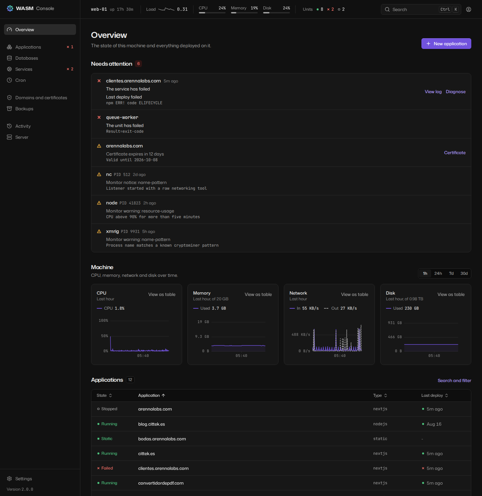
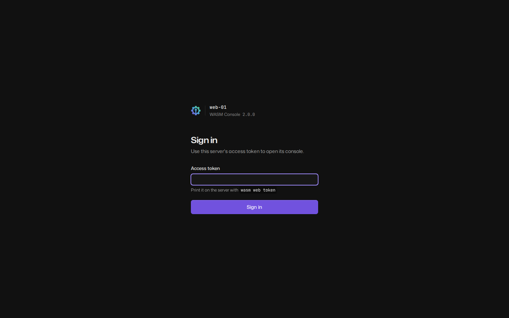
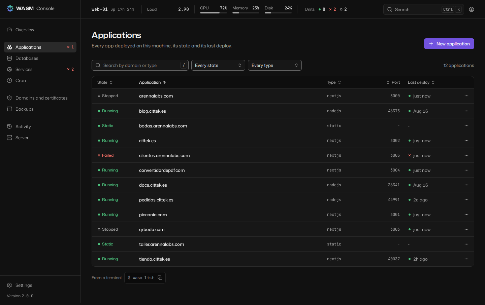
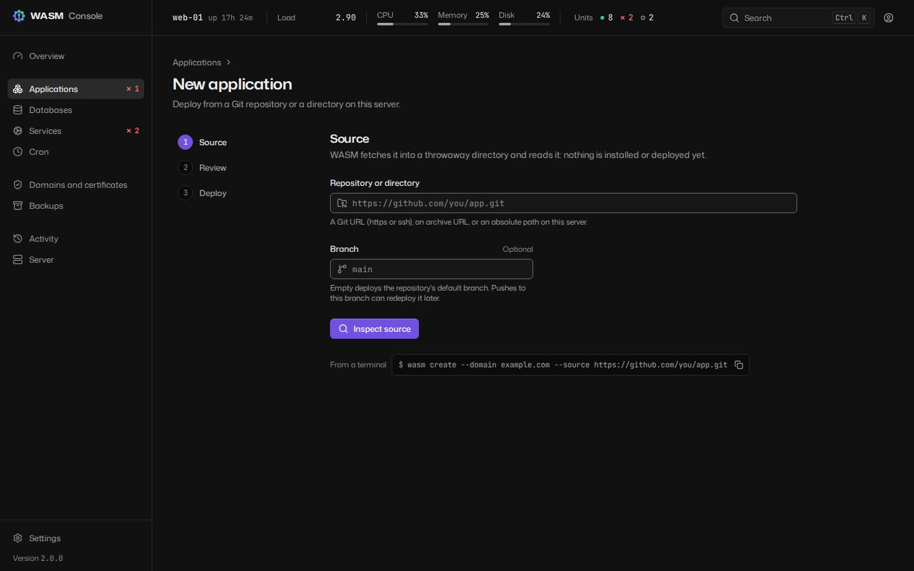
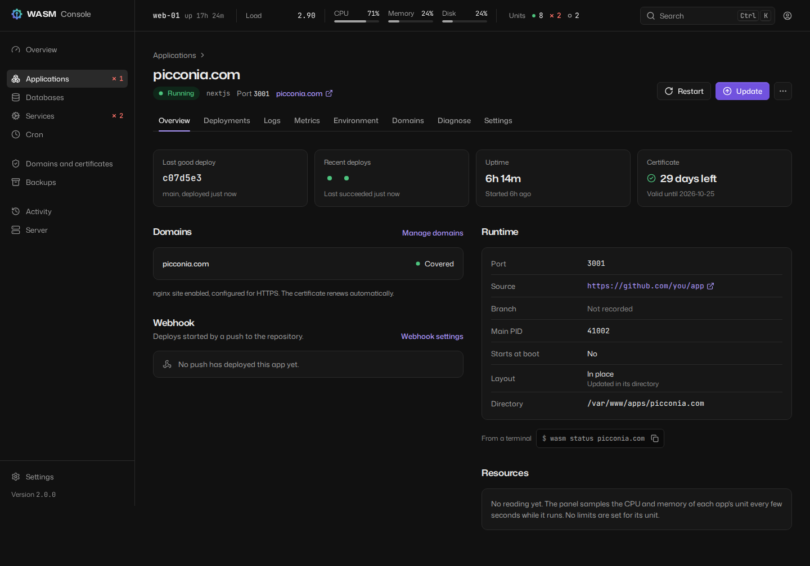
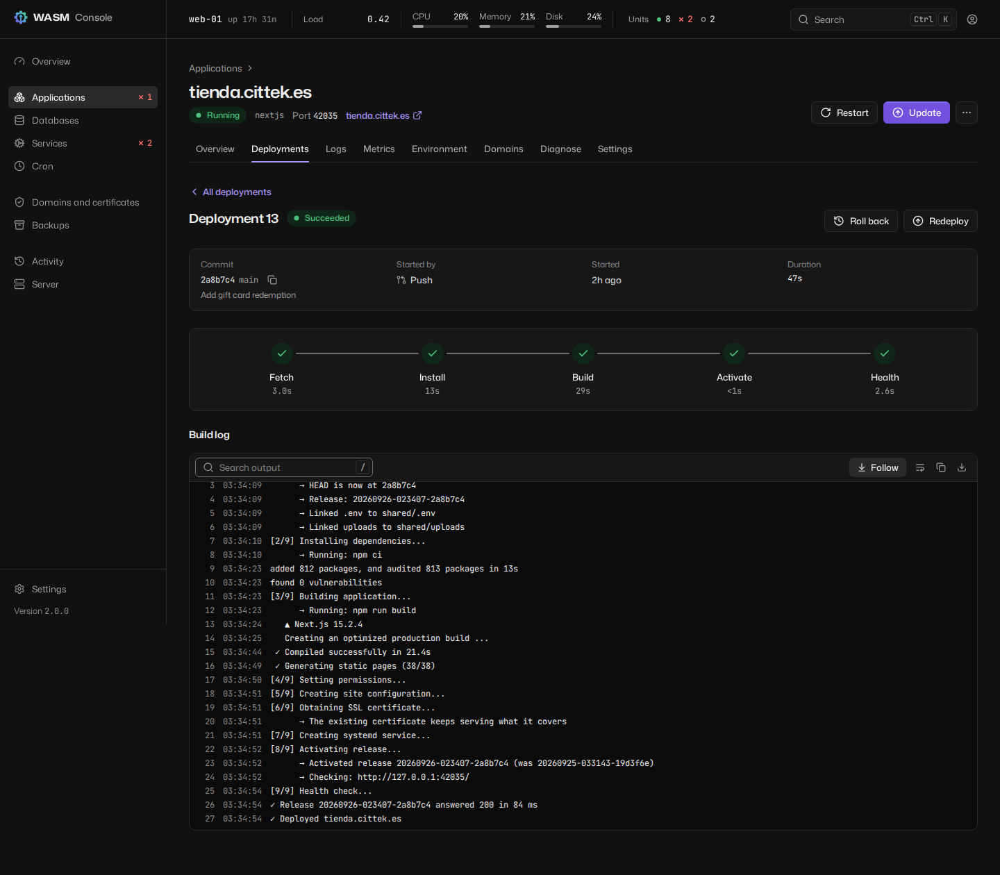
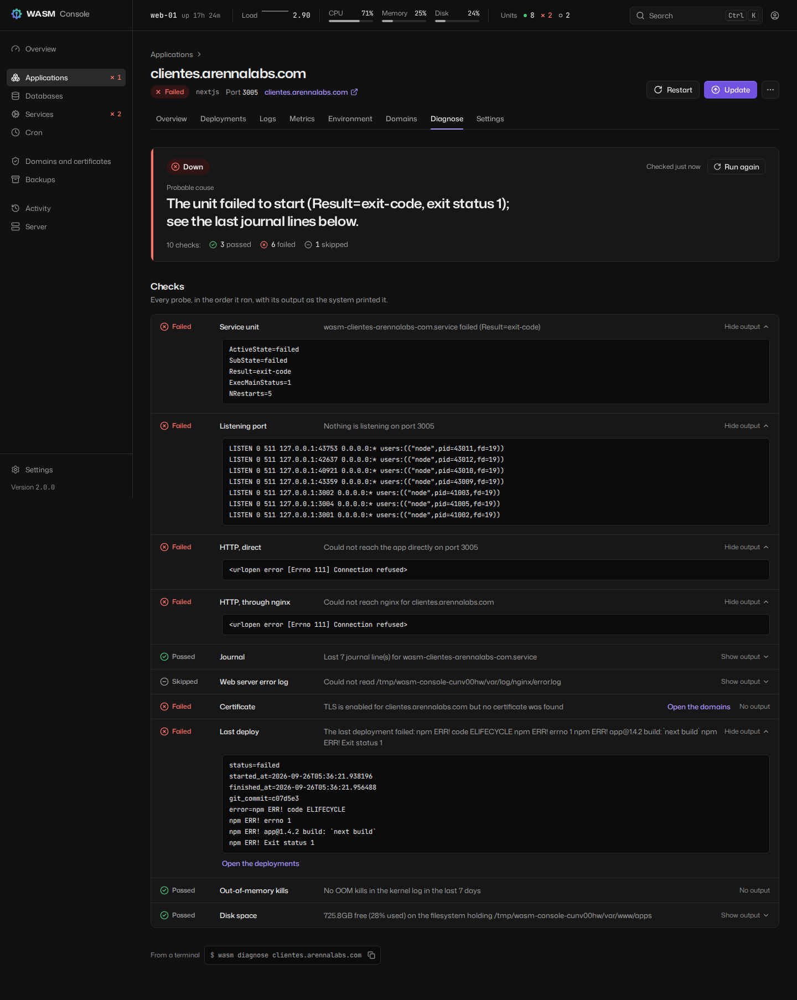
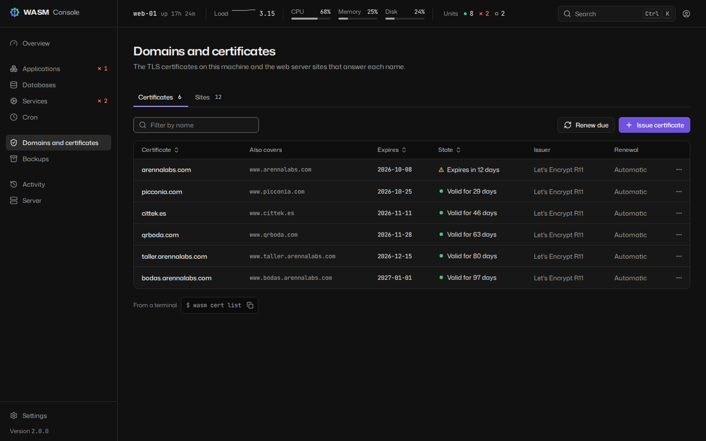

# The console

The WASM Console is the browser interface to a server running WASM. It is a single-page
application built into the package and served by `wasm web start`: no Node, no build step
and no CDN at install time, and nothing is loaded from any other origin at run time. It is a
client of the same [API](api.md) scripts use, so everything on screen is something the API
can do.



## Starting it

```bash
wasm web start            # foreground, 127.0.0.1:8080; prints the access token
wasm web start -d         # background; prints no token
wasm web token --new      # issue a token to sign in with
wasm web status
wasm web stop
```

Every start issues a new access token and prints it once, in the same banner whether it runs
in the foreground or, with `-d`, in the background: the parent process prints it before
handing the server over to the child, so it is never silently issued unseen. `wasm web
token` without options only reports whether a token is issued: the token itself is stored as
a salted hash and cannot be shown again. A running console reads the token from disk on
every request, so issuing a new one with `wasm web token --new` retires the old one at once,
with no restart needed; see [security.md](security.md#authentication) for more, including
what `--regenerate` invalidates beyond the token itself.

`wasm web start -d` runs the console as a background process, with its log in
`/var/log/wasm/web.log` and its PID in `/var/run/wasm-web.pid`. It is not a systemd unit and
does not start again after a reboot. `wasm web restart` takes the same options as `start`
and does not remember the ones used before: pass them again.

If the console's Python packages are missing, `wasm web start` says which and offers to
install them; `wasm web install --apt` or `--pip` installs them directly.

### Reaching it

The console acts as root, so it listens on loopback unless you give it TLS.

**Over SSH (the default and the safest).** Leave it on `127.0.0.1` and forward the port from
your own machine:

```bash
ssh -L 8080:127.0.0.1:8080 root@server.example.com
# then open http://localhost:8080
```

**With TLS served by WASM.** Binding to anything but loopback requires a certificate:

```bash
wasm web start -d --host 0.0.0.0 --tls-cert /etc/letsencrypt/live/panel.example.com/fullchain.pem \
                                 --tls-key /etc/letsencrypt/live/panel.example.com/privkey.pem
wasm web start -d --host 0.0.0.0 --self-signed    # minted under /etc/wasm/panel-tls, reused while valid
```

**Behind a reverse proxy that terminates TLS.** Keep the console on loopback and declare the
proxy, so the session cookie is marked `Secure` and client addresses are the real ones:

```bash
wasm web start -d --trusted-proxy 127.0.0.1
```

`--allow-ip ADDR/CIDR` (repeatable) restricts who may connect at all. `--insecure-http` serves
cleartext beyond loopback; the token and the session cookie then cross the network
unencrypted. See [security.md](security.md) for the full rules.

### Signing in



The sign-in page shows the hostname and the WASM version of the server before asking for
anything, so a token is never typed into the wrong server. Paste the access token; if
two-factor authentication is on, the next step asks for a code from the authenticator app or
one of the backup codes. Five failed attempts from one address lock it out for 15 minutes,
and the page counts down.

A session lasts 12 hours without activity and never more than 24 hours. Enrol two-factor
authentication under Settings > Security, or with `wasm 2fa enroll` and `wasm 2fa confirm`.

## Layout

- **Sidebar**: Overview, Applications, Databases, Services, Cron, Domains and certificates,
  Backups, Activity, Server, and Settings at the bottom. On a narrow screen it becomes a menu.
- **Top bar**: the machine strip (hostname, uptime, load, CPU, memory, disk, and units running
  and failed), the command palette, and the session menu (theme, keyboard shortcuts, sign
  out).
- The browser tab is titled `<page> - <hostname> - WASM`.

Colour means state and nothing else: green running, amber in progress, red failed, grey
stopped, and violet for what you can interact with. Every state also has a shape and a text
label. When a system tool fails, its own output is shown verbatim in a monospace block, with
the suggested fix above it.

## Pages

### Overview

What needs attention, machine charts, every application with its state, and the recent
deployments. "New application" starts the wizard.

### Applications



Every application with its state, type, port, last deploy, CPU and memory, filterable by
state and type.

**New application** (`/apps/new`) takes three steps: **Source** (a Git URL or a directory on
the server, and a branch), **Review** and **Deploy**. The server inspects the repository
before anything is created: the detected type (editable), install, build and start
commands, port, and the variables declared in `.env.example` as a form, with secrets
flagged. It checks the domain's DNS, then deploys and streams the build log until the
application answers.



### One application

The header shows the domain, state, type, port and a link to the live site, and a banner
while a job runs on it or when its last deploy failed. Tabs:

| Tab | What it has |
|---|---|
| Overview | Last deploy, uptime, certificate, domains, webhook, runtime facts, and resource use against its limits |
| Deployments | Deployment history; for an application on releases, its releases with their status, and **Roll back to this** or **Activate** on each one on disk |
| Logs | The unit's journal, live |
| Metrics | CPU and memory over the last hour, 24 hours, 7 or 30 days, against its limits, with deploys marked |
| Environment | The `.env`, redacted; revealing and editing need sudo mode. Changes are staged and reviewed before saving; a restart applies them |
| Domains | Primary, aliases and redirects, with a DNS check per name; add a name as an alias or a redirect |
| Diagnose | [Why it is down](#diagnose): every check, verdict and probable cause |
| Settings | Source, releases (**Enable releases** for an application in place), resource limits, webhook, and the danger zone |



Each deployment has its own page: commit, trigger, duration, a phase timeline, the build log
(live while it runs, with "Show the whole log" when it was truncated), and on failure a link
to Diagnose plus Roll back and Redeploy.



On an application on releases, rolling back switches `current` and restarts behind the
health gate in seconds, and is not a job. On one in place, rolling back restores a backup and
runs as a job. See [releases.md](releases.md).

**Settings > Releases** plans the migration of an application in place ("Plan the
migration"), shows what moves to `shared/` and any warnings, and runs it after confirmation.
**Resource limits** sets memory (MB, at least 64), CPU (percent of one core) and tasks (at
least 16), optionally restarting so they apply now. **Danger zone** deletes the application,
optionally with its files and certificate, after you type its domain.

### Diagnose



Correlates the unit's state, the port it listens on, an HTTP probe straight to the
application and one through nginx, the last journal lines, nginx's error log for the domain,
the certificate, the last deployment, OOM kills in the last seven days and disk space. The
most likely cause comes first, with each check's evidence verbatim. Every probe only reads.
The same report is `wasm diagnose DOMAIN`.

### Databases

Engines with their state (install, start, stop, restart, uninstall), databases, users and
database backups. One database's page has its size, owner and encoding, a SQL runner
(read-only by default; write mode needs sudo mode), its backups and a connection string.

### Services

Every systemd unit WASM manages. "Show all units" also lists what other packages installed,
read-only. A service's page has its live journal, start, stop, restart, enable, disable, and
an editor for its unit file that is checked with `systemd-analyze verify` before saving.

### Cron

Scheduled commands as systemd timers: create or edit with a preview of the next runs, run
now, enable, disable, and each job's recent runs with their output and exit status.

### Domains and certificates

Two tabs. **Certificates**: every certificate with its names, issuer and expiry; issue one
(method: automatic, nginx, Apache, webroot or standalone; extra names; `www`), renew those
due, renew one now, revoke, delete. **Sites**: every nginx or Apache site; create, enable,
disable, delete, and edit a site's configuration, which is tested by the web server before it
is installed.



### Backups

Storage used per application, every backup (verify, restore, delete), backup schedules, and
"New backup" with the same options as `wasm backup create`.

### Activity

Every job and every audited action on this machine in one timeline, newest first, filterable
by kind, result and actor. A job opens its log.

### Server

Health (the same checks as `wasm health`), system facts, network, top processes, and the
resource monitor: install, enable, start, its findings, and a test email.

### Settings

| Section | What it has |
|---|---|
| General | Applications directory, web server, certificate email, backups, and the console address that `--open` links use (it does not move the console) |
| Security | Two-factor authentication, active sessions (sign out others), lockout policy |
| Notifications | The delivery switch, channels (webhook, Slack, Discord, Telegram, email) with a test button each, which events notify, and private destinations allowed |
| API tokens | Issue (shown once), list and revoke |
| About | Version and updates, installation, CLI equivalents, links |

Writing any setting needs sudo mode.

## Keyboard

| Keys | Does |
|---|---|
| `Ctrl K` / `Cmd K` | Open the command palette, from anywhere |
| `g` `o` | Go to Overview |
| `g` `a` | Go to Applications |
| `g` `b` | Go to Databases |
| `g` `s` | Go to Settings |
| `g` `d` | Go to the application's Deployments tab; outside an application, to Activity |
| `/` | Focus this page's search, or open the palette when it has none |
| `?` | Show the keyboard shortcuts |

Two-key sequences are typed one after the other within about a second. They do nothing while
you type in a field or while a dialog is open. Inside a log viewer, `Ctrl F` / `Cmd F`
focuses its search; `Enter` and `Shift Enter` step through matches.

The **command palette** searches pages (including each Settings section), applications with
their state, and actions: new application, change theme, keyboard shortcuts, sign out. Arrow
keys or `Ctrl N` / `Ctrl P` move, `Enter` runs, `Esc` closes.

## Sudo mode

Destructive and credential-changing actions (deleting anything, restoring a backup, revealing
or editing an `.env`, moving to releases, changing limits, editing a unit or a site, SQL in
write mode, changing settings, issuing a token, disabling 2FA) ask you to confirm it is you:
a dialog titled "Confirm it's you" asks for an authenticator or backup code, or for the access
token when 2FA is off. The confirmation covers the next 10 minutes, and the action you were
taking is retried once confirmed. Flows that already know they need it, such as deleting an
application, ask before their own confirmation dialog, so only one is ever on screen.

## Live updates

The console holds one Server-Sent Events stream for the machine strip, charts, application
states, job progress and notifications, and opens a WebSocket for a log or a running job
while you look at it. If the connection drops it reconnects with backoff and refreshes
everything it shows. Log viewers render ANSI colours, search, follow the newest line (pausing
when you scroll up, with a "Jump to latest" button), wrap, copy and download.

## Themes

Light, dark, or the system's (the default), from the session menu or the command palette.
The choice is kept in the browser's local storage (`wasm.theme`) and applies to every open
tab.

## From the terminal

`--open` on `wasm list`, `wasm status`, `wasm logs`, `wasm db list`, `wasm backup list` and
`wasm monitor status` prints the matching console URL, and opens it when a display is
available. The address comes from `web.host` and `web.port` in the configuration (Settings >
General), which only affect these links: where the console listens is decided by the options
of `wasm web start`.

## Accessibility

The console targets WCAG 2.2 level AA, and that is tested rather than declared:

- The end-to-end suite runs axe (WCAG 2.0, 2.1 and 2.2, levels A and AA) on every page, in
  both themes, and fails on any violation. It also fails on any Content Security Policy
  violation or console error.
- Colour contrast of the design tokens is checked by unit tests in both themes: 4.5:1 for
  text, 3:1 for interface elements.
- Everything works from the keyboard. Focus is always visible, a "Skip to content" link comes
  first, dialogs trap focus and return it, and after navigating focus moves to the new page's
  title.
- State is never colour alone: it always has a shape and a text label.
- Deploy transitions are announced politely and failures assertively through live regions.
  Log lines are never announced.
- Every chart has a text summary and a "View as table" alternative.
- With `prefers-reduced-motion`, transitions are instant.

If something in the console is not usable with your assistive technology, please open an
issue on GitHub.
